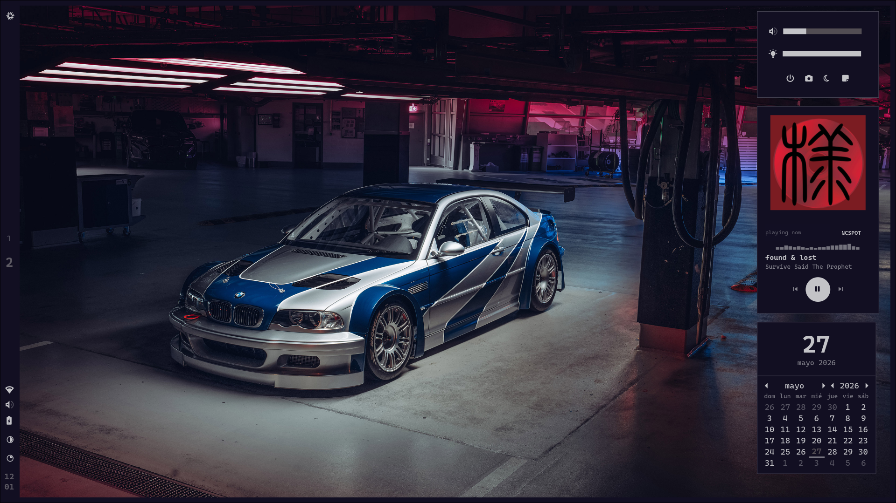
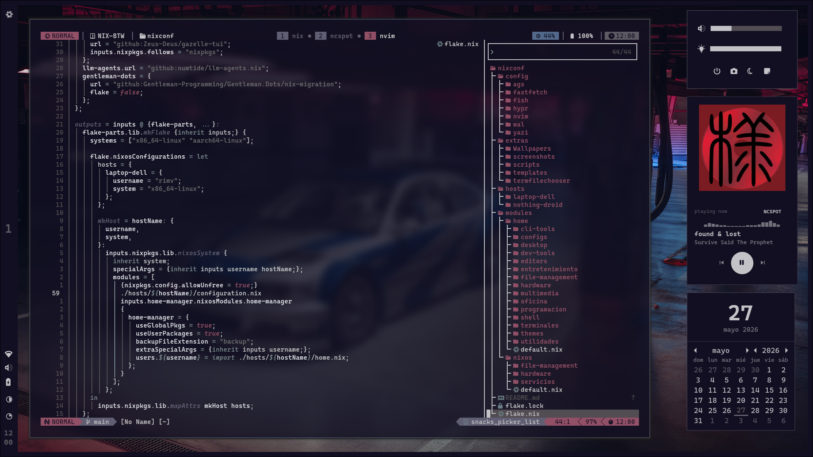

# ❄️ nixconf

Configuración personal de NixOS — [@numbpi](https://github.com/numbpi)

> NixOS + Home Manager + Hyprland + AGS + 👻

---

## 📸 Screenshots

### Escritorio



### Neovim



---

## 🖥️ Stack

| Capa | Tecnología |
|------|-----------|
| **OS** | NixOS (unstable) |
| **WM** | Hyprland |
| **Shell** | Fish + Starship + Atuin |
| **Bar / Shell** | AGS (Aylur's GTK Shell) |
| **Terminal** | Kitty |
| **Editor** | Neovim (nightly) |
| **File Manager** | Yazi (TUI) + Thunar (GUI) |
| **Browser** | Zen Browser |
| **Launcher** | AGS App Launcher |

---

## 🗂️ Estructura del proyecto

```
nixconf/
├── flake.nix                    # Entry point — inputs + mkHost
├── hosts/
│   └── laptop-dell/             # Config específica de la laptop
│       ├── configuration.nix    # NixOS (sistema)
│       └── home.nix             # Home Manager (usuario)
├── modules/
│   ├── nixos/                   # Módulos de sistema (services.*, hardware.*)
│   │   ├── hardware/tlp.nix
│   │   ├── servicios/{pipewire,samba,avahi,cups}.nix
│   │   └── file-management/thunar.nix
│   └── home/                    # Módulos de usuario (home.packages, programs.*)
│       ├── desktop/{ags,hyprland}.nix
│       ├── editors/neovim.nix
│       ├── shell/fish.nix
│       ├── cli-tools/{yazi,tmux/}...
│       ├── terminales/{kitty,ghostty}.nix
│       └── ...
├── config/                      # Dotfiles out-of-store (symlinks)
│   ├── hypr/                    # Hyprland (Lua)
│   ├── ags/                     # AGS shell (TypeScript)
│   ├── nvim/                    # Neovim
│   ├── fish/                    # Fish shell
│   ├── yazi/                    # Yazi file manager
│   └── wal/                     # Pywal color schemes
└── extras/                      # Assets complementarios
    ├── scripts/
    ├── Wallpapers/
    ├── templates/               # Plantillas Typst
    └── screenshots/             # Capturas de pantalla
```

---

## 🚀 Instalación

```bash
# Clonar
git clone https://github.com/numbpi/nixconf.git ~/nixconf
cd ~/nixconf

# Compilar y activar
sudo nixos-rebuild switch --flake .#laptop-dell

# O con nh (recomendado)
nh os switch .
```

> **Nota:** los dotfiles en `config/` están linkeados como symlinks out-of-store al directorio `~/nixconf/config/`. Si clonás en otra ruta, actualizá los paths en `home.nix`.

---

## 🏷️ Licencia

MIT
